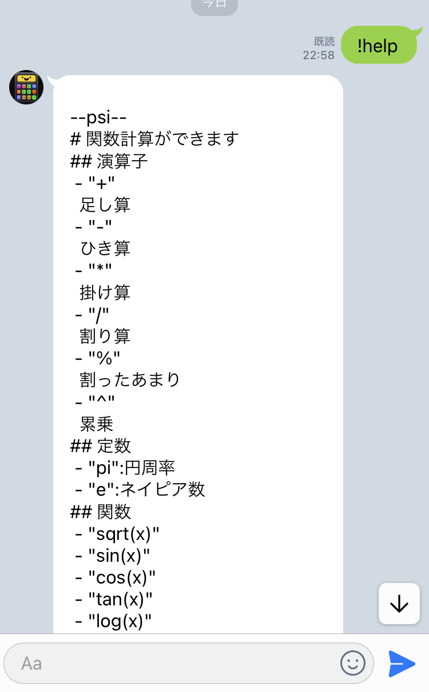
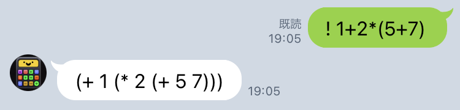

# PSI

## 関数計算のためのラインボット

.png)


LINEbotの友達追加は下のurlから👇👇👇


## 使い方

コマンドは大文字でも小文字でも構いません。
但し、コマンドの後には半角スペースを挿入する必要があります

- **HELP**コマンド

    コマンドや使える関数一覧を返却します

    ```psi
    !help
    ```

    

- **EVAL**コマンド

    与えられた`<計算式>`が内部的にどのように解釈されているかを知ることが出来ます。返却された値はポーランド記法で返却されるネスト上データとなっています

    ```psi
    !eval <計算式>
    ```

    

- **CALC**コマンド

    実際に`<計算式>`を実行して計算結果を返却します[^1]

    ```psi
    !calc <計算式>
    ```

    

## リポジトリについて

calc_parser.jsはボットのコードそのものではなく計算を評価する部分の抜粋です。
js版で何言ってんだこいつと思った人は[formuliteレポジトリ](https://github.com/Tom-game-project/formulite)も参考にしてみてください[PyPi](https://pypi.org/project/formulite/)に公開しているpython用のモジュールで、大体の挙動は同じです。

## ライセンス

[MIT](LICENSE.MIT)

[^1]:javascriptの`Math`の関数を使っています。実際の計算結果と多少の誤差がある場合があります。

